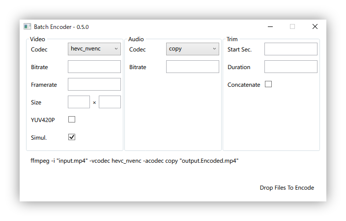

# Batch Encoder

Encode multiple movie files super easy and ultra-fast. (with dedicated GPU)

This app is wrapper GUI for the [ffmpeg](https://ffmpeg.org/).

## Usage

1. Set options.
2. Drop file(s).

## Option

Let field empty to use automatic setting.

## Prerequisite

You need to have ffmpeg added to your PATH.

## Roadmap

- Fade-in and out
- ffmpeg included binary
- Custom ffmpeg path
- Queue List (currently queue is not shown)
- More friendly UI
- More options.

## License

### Batch Encoder

[MIT License](LICENSE)

### ffmpeg

Currently not included in this repository, but you **MUST** check when you use patented codec.

[FFmpeg License and Legal Considerations](http://ffmpeg.org/legal.html)
